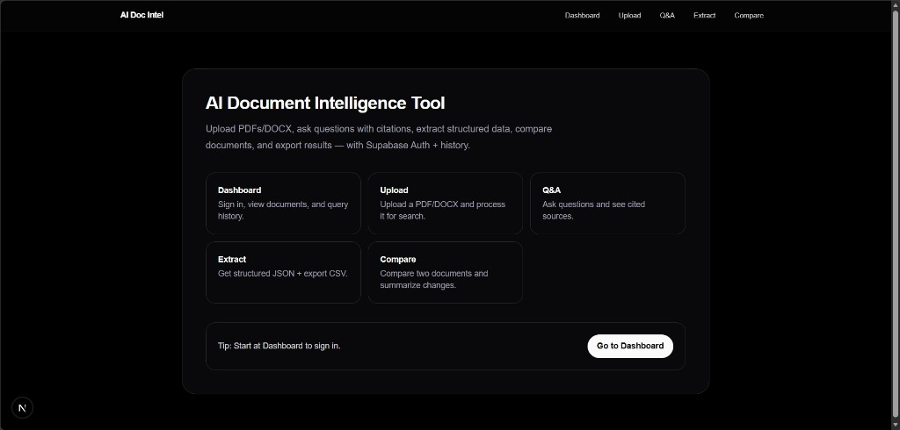

## AI Doc Intel — Document Q&A Platform (Case Study)

AI Doc Intel is a full-stack document intelligence app that turns PDFs/DOCX files into a searchable knowledge base. Users upload a document, the system chunks and embeds it, and then supports **Q&A**, **structured extraction**, and **document comparison** with citations.

### Why this exists

Teams often receive unstructured documents (resumes, contracts, project docs, reports) and lose time skimming them repeatedly. The goal here is a small, production‑minded MVP that:

- indexes private documents per user
- retrieves relevant context via vector search
- answers questions with page‑level citations

### What I built

- **Frontend**: Next.js App Router UI with Supabase Auth and a clean workflow (Upload → Q&A / Extract / Compare).
- **Backend**: FastAPI service for file parsing, chunking, embedding, retrieval, and LLM responses.
- **Data layer**: Supabase Postgres with `pgvector` + an RPC for similarity search, plus Storage for document files.

### System design (high level)

- **Upload**: user uploads PDF/DOCX → backend stores file in Supabase Storage and creates `documents` record.
- **Indexing**: backend parses and chunks pages → generates embeddings → stores rows in `chunks` (vector column).
- **Retrieval**: question embedding → `match_chunks` RPC (cosine similarity) → top chunks returned.
- **Generation**: LLM answers using only retrieved context → returns answer + sources (page citations).

### Key features

- **Upload & processing**: PDF/DOCX parsing, chunking, embeddings, per-user isolation.
- **Q&A with citations**: retrieval‑augmented answers with page references.
- **Extract**: structured JSON extraction for dates, names, key facts, tables, and a summary.
- **Compare**: JSON output describing similarities/differences between two documents.
- **Query history**: persisted Q&A results per user/document.

### Security & privacy posture (MVP)

- **Row Level Security (RLS)**: users can only read their own `documents`, `chunks`, and `queries`.
- **Backend uses service role**: server-side calls use `SUPABASE_SERVICE_KEY` (never expose it to the browser).
- **Secrets**: `.env` files are intentionally ignored by git (see `.gitignore`).

> Note: For the simplest MVP, the Storage bucket can be public. For a stricter posture, switch to private bucket + signed URLs.

### Tech stack

- **Frontend**: Next.js (React), Supabase JS, Tailwind
- **Backend**: FastAPI, Uvicorn, LangChain + OpenAI-compatible SDK
- **Infra**: Supabase Postgres + `pgvector`, Supabase Storage

### Screenshot



### Local setup (step-by-step)

#### 1) Supabase (one-time)

**Create database schema + RPC**

- Supabase → **SQL Editor**
- Run `backend/supabase_setup.sql`

This creates:

- tables: `documents`, `chunks`, `queries`
- `vector` extension
- RPC: `match_chunks` (vector similarity search)
- RLS policies (user isolation)

**Create Storage bucket**

- Supabase → **Storage** → **New bucket**
- Name: `documents`
- MVP option: set to **Public**

#### 2) Backend (FastAPI)

Create `backend/.env` from `backend/.env.example` and fill values:

- `OPENAI_API_KEY`
- `SUPABASE_URL`
- `SUPABASE_SERVICE_KEY`
- `SUPABASE_ANON_KEY`

Run:

```bash
cd backend
python -m venv venv
venv\Scripts\activate
pip install -r requirements.txt
uvicorn main:app --reload --port 8000
```

Health:

- `GET http://localhost:8000/health` → `{"status":"ok"}`

#### 3) Frontend (Next.js)

Create `frontend/.env.local` from `frontend/.env.example`:

- `NEXT_PUBLIC_SUPABASE_URL`
- `NEXT_PUBLIC_SUPABASE_ANON_KEY`
- `NEXT_PUBLIC_API_URL` (default `http://localhost:8000`)

Run:

```bash
cd frontend
npm install
npm run dev
```

Open:

- `http://localhost:3000`

### How to use

1. Sign in from **Dashboard** (magic link).
2. Upload a PDF/DOCX from **Upload**.
3. Copy the returned `document_id`.
4. Ask questions in **Q&A**, or run **Extract**.
5. Upload a second doc and use **Compare** with both IDs.

### Project structure

```
ai-doc-intel/
  backend/          # FastAPI (upload, retrieval, LLM)
  frontend/         # Next.js UI
```

### Troubleshooting

- **“Failed to fetch” on upload**: backend is not reachable at `NEXT_PUBLIC_API_URL`.
- **Python compatibility**: if you hit `pydantic_core` import errors, use **Python 3.12** for the backend venv.
- **Invalid API key**: ensure `OPENAI_API_KEY` matches the provider you configured (and any base URL/model overrides).
